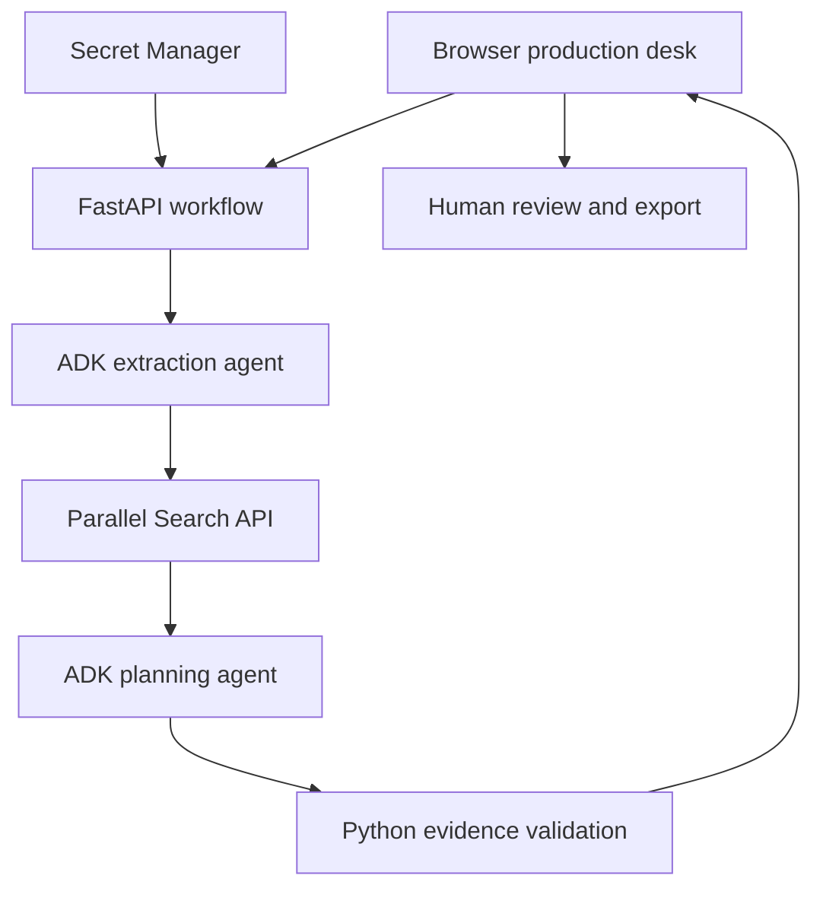

# SceneReady Studio

Turn a film scene brief into a reviewable preproduction plan.

This is the next working version of SceneReady for the Parallel track. It keeps the
Google Cloud + Gemini + ADK + Parallel integration, adds a professional browser UI,
and replaces a prompt-only tool choice with a fixed Python workflow.

## Start in Google Cloud Shell

Upload and extract this package into a NEW `~/sceneready-studio` folder. Your earlier
`~/sceneready` terminal agent can stay as it is.

```bash
cd ~/sceneready-studio
bash scripts/setup.sh
.venv/bin/python scripts/run_local.py
```

Select **Web Preview > Preview on port 8080** in Cloud Shell. The startup script
reads `parallel-api-key` from Secret Manager in the selected Google Cloud project.
No keys are embedded in this package or written to disk by that script.

The setup script creates this project's own virtual environment, installs the
versions observed in your successful Cloud Shell screenshots, runs dependency and
validation checks, then checks agent constructors and imports. If it fails, stop and
inspect that error before starting the app. Do not repeatedly reinstall unrelated tools.

To practice the interface without provider calls:

```bash
.venv/bin/python scripts/run_local.py --demo
```

Offline rehearsal is prominently labeled and returns illustrative planning tasks,
with no sources. It is NEVER substituted automatically after a live error. Use a
successful LIVE run in the submission demonstration.

## What is implemented

- Responsive production desk with original CSS and no external frontend dependencies.
- Typed brief input, plain-text file import, eight-scene limit, character and crew bounds.
- Two Google ADK LlmAgents: script extraction and production planning.
- Python-controlled ordering: extraction → Parallel research → planning → validation.
- At most three Parallel Search requests, up to three retrieved results per request,
  duplicate URLs removed, bounded excerpts, timeouts, and visible partial-research failures.
- Matching of model quotations to retrieved text. Unknown source IDs and invalid quotes
  are removed; sources and matching script snippets stay inspectable.
- Streaming workflow progress, stage timings, actual search query/status log.
- Department/priority filters, editable action text, owner assignment, notes, and review status.
- Revision comparison by task title and changed brief fields; reviews reset on every new run.
- JSON export with complete report/provenance and Markdown export of a readable review pack.
- Secrets loaded on the server, API access code for Cloud Run, limited concurrent runs,
  escaped frontend output, response security headers, bounded input, and redacted errors.
- MIT license, unit tests, setup checks, Dockerfile, and a separate Cloud Run deployment guide.

## Architecture



The ADK agents use Gemini on Google Cloud via application default credentials.
The research stage is a direct Parallel API call. There is no external AI provider,
LangChain dependency, or additional MCP server. A fixed stage order does not make
model outputs deterministic. Source matching does not prove a claim is correct.

## Prompt design

`app/prompts.py` has separately versioned extraction and planning prompts. Structured
outputs are parsed with Pydantic. The extraction agent identifies only stated details;
the planning agent returns scoped suggestions and questions with source IDs and short
verbatim evidence. Script text and retrieved content are explicitly treated as data.

Python controls call counts and sequencing, checks quotes and IDs, and assigns the
initial unreviewed state. It does not rely on an LLM instruction to enforce those gates.
Prompts reduce instruction-injection risk but do not eliminate it. The agents have no
tools for executing code, accessing arbitrary secrets, sending messages, or submitting permits.

## State and privacy

This version keeps the completed report and review changes in browser memory. It
does NOT autosave or share them. Closing/reloading the page loses that state. Export
before closing. Session data is in-memory and short-lived on the server; it is not
stored in Firestore or Cloud Storage. It is not a multiuser collaboration product yet.

In live mode, Google receives the production brief and research excerpts. Parallel
receives city/topic search queries; the application does not send the entire script
to Parallel. Provider retention terms still apply. Use an original sample script for
the hackathon demo; do not upload confidential studio material without authorization.

## How to assess the result honestly

1. Run the supplied Mumbai example in live mode.
2. Confirm the Run log contains successful Parallel searches.
3. Open the source URLs and verify task quotes, scope, publication date, and current relevance.
4. Review an action, assign an owner, and export the report.
5. Edit the date, location, or a scene detail and rerun. Confirm reviews reset and the
   comparison describes actual changed input fields. Title-based differences are not
   a semantic change detector and may reflect model wording.
6. Use the tests to check missing sources, fabricated quotes, malformed input,
   duplicate scene IDs, partial failure, and run isolation.

## Known limits / next gates

- This package is an implementation candidate, not a claim of production readiness.
- Local validation tests and syntax checks are separate from a real SDK/network run.
  See `VALIDATION.md` for the exact verification completed when this package was produced.
- A matched quotation can still be irrelevant, misleading, stale, or misinterpreted.
  Reviewers must verify claims. No readiness score or legal clearance is generated.
- The three-query cap means some scene topics may remain unresearched. Topics are selected
  by the extraction agent. Check the Run log and treat gaps as unknowns.
- No PDF parsing, OCR, image/video generation, live weather, cost estimates, or actual
  permit submissions. Text import is `.txt` only. These are deliberate scope boundaries.
- Reviewer identities are self-entered and not authenticated individually. Review notes
  are editable; this is not a tamper-proof compliance audit trail.
- Cloud Run startup requires a studio access code. The current code uses a shared secret,
  not enterprise SSO. Add individual authentication and durable state before real studio use.
- Cloud Run max-instance and concurrency settings reduce exposure but are not spending caps.
- The date field is user-provided. The app does not check availability or book resources.

## Hackathon rules to resolve

The supplied Section 7.B limits AI tooling to Google Cloud and the selected partner,
and names OpenAI among prohibited AI tools. It does not clearly exempt development
assistants. Obtain organizer clarification on non-Google coding assistance before
submitting code developed here. This runtime uses only Gemini/ADK and Parallel, but
runtime compliance alone does not establish development-tool eligibility. Do not
misrepresent how the project was built.

The supplied rules require a hosted web/mobile app, public open-source repository,
real runtime integrations, and a public English demo of at most three minutes.
Confirm the current official requirements before submission. Nothing here guarantees a prize.

## Official references

- ADK: https://adk.dev/get-started/python/
- Structured agent outputs: https://adk.dev/agents/llm-agents/
- Parallel Search: https://docs.parallel.ai/search/search-quickstart
- Secret Manager: https://docs.cloud.google.com/secret-manager/docs/access-secret-version
- Cloud Run secrets: https://docs.cloud.google.com/run/docs/configuring/services/secrets
- Event rules: https://agentic-cinema.devpost.com/rules

## Code map

`app/schemas.py` typed input/output and deterministic citation validation

`app/prompts.py` versioned prompts

`app/providers.py` real Google ADK and Parallel integrations

`app/workflow.py` fixed workflow and streaming events

`app/main.py` API, request limits, access control, and static UI serving

`static/` dashboard, responsive styling, interaction, review, and exports

`scripts/` setup, import check, local launch, and deployment

`tests/` validation and orchestration behavior tests without live API calls
