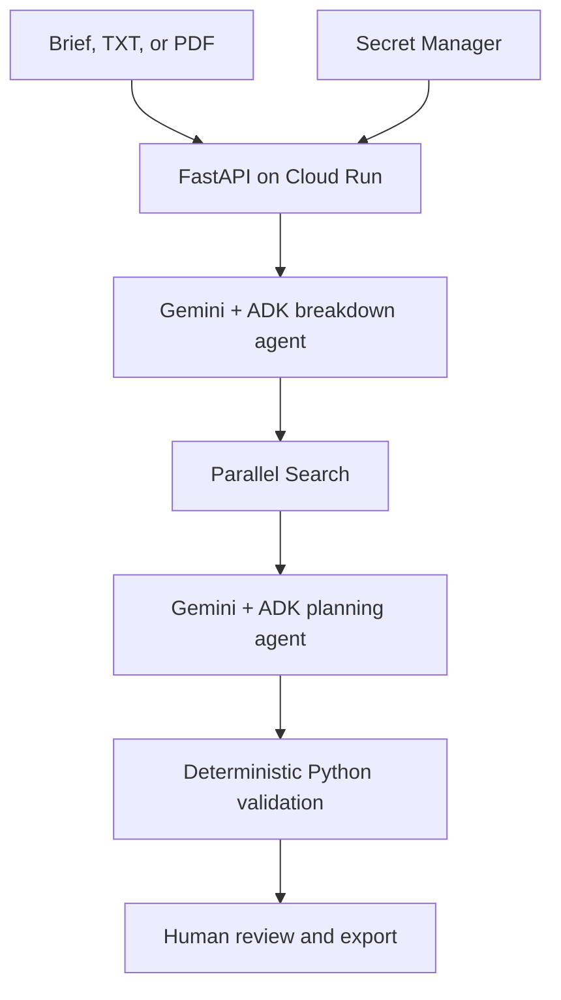

# SceneReady Studio

**An evidence-grounded AI preproduction desk for film crews.**

SceneReady turns a screenplay or production brief into a structured scene breakdown,
authoritative location research, and a human-reviewable action board. It is built for
the **Parallel track** of Google Cloud's Agentic Cinema hackathon.

[Open the live Cloud Run app](https://sceneready-studio-690971413573.us-central1.run.app/) ·
[Read the demo plan](DEMO_PLAN.md) · [View validation evidence](VALIDATION.md)

> The dashboard is public, while Gemini/Parallel requests require the private studio
> access code. SceneReady provides preliminary planning support—not legal clearance or
> permission to film.

## The problem

A short scene can create dozens of disconnected preproduction questions: Who controls
the location? Is a drone allowed? Which permit applies? What must the location team verify?
Crews often research these questions manually, lose the supporting links, and struggle to
turn findings into accountable next steps.

SceneReady keeps that work in one reviewable flow:

1. Read an editable brief or Gemini-extracted PDF screenplay.
2. Break it into bounded, typed scene data using a Google ADK agent.
3. Research relevant rules through Parallel Search, prioritising official sources.
4. Build an actionable production board with a second ADK agent.
5. Match cited excerpts deterministically in Python before displaying them.
6. Let a human edit, assign, review, compare revisions, and export the result.

## What is live

| Capability | Implementation |
|---|---|
| Screenplay input | Typed brief, local `.txt`, or protected PDF extraction with Gemini document understanding |
| Agent workflow | Two Google ADK `LlmAgent`s using Gemini on Vertex AI |
| Partner integration | Parallel Search is imported and called at runtime for authority-focused research |
| Evidence checks | Source IDs, URLs, excerpts, duplicates, and quotation matches validated in Python |
| Human review | Edit actions, assign departments, add notes, mark reviewed, and reset reviews on rerun |
| Provenance | Visible search queries, partial failures, stage timings, source cards, and run mode |
| Export | Complete JSON provenance plus a readable Markdown production report |
| Hosting | FastAPI container on Google Cloud Run with Secret Manager-backed credentials |

## Product experience

- Per-scene **Generate Storyboard**: Gemini plans 2–4 shots, then Google image generation
  renders reference-conditioned frames with camera metadata. See [STORYBOARDS.md](STORYBOARDS.md)
  for setup, usage, and live-validation status.

- Premium cinematic production desk with responsive, accessible, dependency-free UI.
- Four visible stages: **Break down → Research → Plan → Validate**.
- Scene, action-board, evidence, and run-log views in one workspace.
- Priority and department filters for fast crew handoff.
- Revision comparison after material brief changes.
- Clear unknowns and follow-up questions instead of invented certainty.
- Explicit `LIVE` versus `OFFLINE REHEARSAL` labeling.

## Architecture



The stage order and search-call budget are enforced by Python. The models cannot skip
research, increase the query cap, approve permits, or perform external actions.

## Technology

| Layer | Technology |
|---|---|
| Frontend | Original HTML, CSS, and vanilla JavaScript |
| API | Python 3.12, FastAPI, Pydantic |
| Agents | Google Agent Development Kit (`google-adk`) |
| Model | Gemini 3.8 Flash through Vertex AI |
| Document analysis | Gemini PDF document understanding |
| Research partner | Parallel Search API (`parallel-web`) |
| Infrastructure | Cloud Run, Cloud Build, Secret Manager, Artifact Registry |
| Testing | Python `unittest`, FastAPI test client, syntax and static-interface checks |

There is no Supabase, LangChain, external AI provider, or hidden database. Current project
and review state lives in the browser and should be exported before closing the tab.

## Quick start in Google Cloud Shell

Prerequisites:

- A Google Cloud project with Vertex AI enabled and Application Default Credentials.
- A Secret Manager secret named `parallel-api-key` containing a valid Parallel API key.
- Python 3.12.

```bash
git clone https://github.com/Akarsh-42/sceneready-studio.git
cd sceneready-studio
bash scripts/setup.sh
.venv/bin/python scripts/run_local.py
```

Select **Web Preview → Preview on port 8080**. The launcher reads the Parallel credential
from Secret Manager; credentials are not stored in the repository.

For a no-cost interface rehearsal with clearly labelled illustrative data:

```bash
.venv/bin/python scripts/run_local.py --demo
```

Offline rehearsal is never substituted after a failed live request. Submission evidence
must come from a successful `LIVE` run.

## Deploy to Cloud Run

The production service is deployed at:

```text
https://sceneready-studio-690971413573.us-central1.run.app/
```

Deployment uses the dedicated `sceneready-runtime` service account and pinned Secret
Manager versions. Follow [DEPLOY.md](DEPLOY.md) for the reproducible setup and redeploy
commands. Never commit or record the Parallel key or studio access code.

## API surface

| Route | Purpose | Protection |
|---|---|---|
| `GET /` | Production desk | Public |
| `GET /healthz` | Container health | Public |
| `GET /api/config` | Non-secret runtime flags | Public |
| `POST /api/extract-document` | Gemini PDF extraction | Bearer studio code |
| `POST /api/run` | Streaming agent workflow | Bearer studio code |

`/api/run` streams newline-delimited JSON so the interface can show each real stage as it
completes. FastAPI and ReDoc documentation routes are disabled in the deployed application.

## Guardrails and privacy

- No credentials are sent to the browser or committed to source control.
- Cloud Run refuses to start without a studio code of at least 24 characters.
- Briefs are limited to 65,536 request bytes; PDFs are limited to 8 MiB.
- One PDF extraction and two planning workflows may run concurrently per process.
- Provider error bodies, scripts, PDFs, retrieved excerpts, and credentials are not logged.
- Security headers include a restrictive Content Security Policy and `no-store` caching.
- Retrieved text and screenplay content are treated as untrusted data in prompts.
- Frontend text is escaped; incomplete or unknown HTML entities remain literal.

Google receives the brief, research excerpts, and PDFs explicitly submitted for extraction.
Parallel receives only bounded city/topic search queries—not the screenplay or PDF. Provider
retention terms still apply; use only material you are authorised to process.

## Evidence discipline

SceneReady verifies that a displayed quotation exists in a retrieved excerpt. It does **not**
claim that a source is current, that a quotation proves the generated recommendation, or that
a permit applies to a particular property. Every task begins unreviewed, and the interface
reminds crews to open sources and confirm applicability with the responsible authority.

## Verification

The complete Cloud Shell suite passes **28 tests**, covering schema compatibility, API access,
PDF limits and signatures, input validation, citation matching, fabricated quotation removal,
duplicate handling, partial research failures, run isolation, and review resets. Successful
live Cloud Run runs have exercised Gemini, Google ADK, Parallel Search, Python validation,
review, exports, revision comparison, and protected PDF extraction.

See [VALIDATION.md](VALIDATION.md) for the detailed record and remaining limitations.

## Repository map

```text
app/
  main.py         FastAPI routes, limits, access control, and static serving
  providers.py    Google ADK, Gemini PDF, and Parallel integrations
  workflow.py     Fixed orchestration and streaming events
  schemas.py      Typed contracts and deterministic evidence validation
  prompts.py      Versioned, injection-aware agent prompts
static/           Production desk UI and browser-side review/export logic
scripts/          Setup, diagnostics, local launch, and Cloud Run deployment
tests/            API, provider-schema, workflow, and validation regressions
```

## Honest limitations

- Browser-only state is not durable or multiuser; export before refreshing or closing.
- Shared studio-code access is not individual authentication.
- Evidence matching is not legal verification or source-freshness scoring.
- The three-query cap intentionally limits cost but can leave topics unresolved.
- Complex layouts, handwriting, and low-quality PDF scans may extract imperfectly.
- SceneReady does not submit permits, send messages, make payments, or book resources.

## Roadmap

- Public, read-only verified sample report for judge access without paid calls.
- Storyboard and mood-board generation with Imagen.
- Persistent projects and reviews with Firestore.
- Individual Google authentication and collaborative review history.
- Production calendar, scheduling, and location-map integration.
- Voice-based script rehearsal.
- Stronger source freshness and authority verification.

## Hackathon alignment

SceneReady is a web application newly built for the Parallel track. Google ADK and Gemini run
the reasoning workflow; Parallel is imported and called at runtime for grounded research;
Cloud Run and Secret Manager host and protect the experience. The repository contains the
source, license, tests, setup instructions, and deployment path required to reproduce it.

Official rules: https://agentic-cinema.devpost.com/rules

## Team and license

Created by **Akarsh Mohanty and contributors** for the Google Cloud Agentic Cinema hackathon.

Released under the [MIT License](LICENSE).
